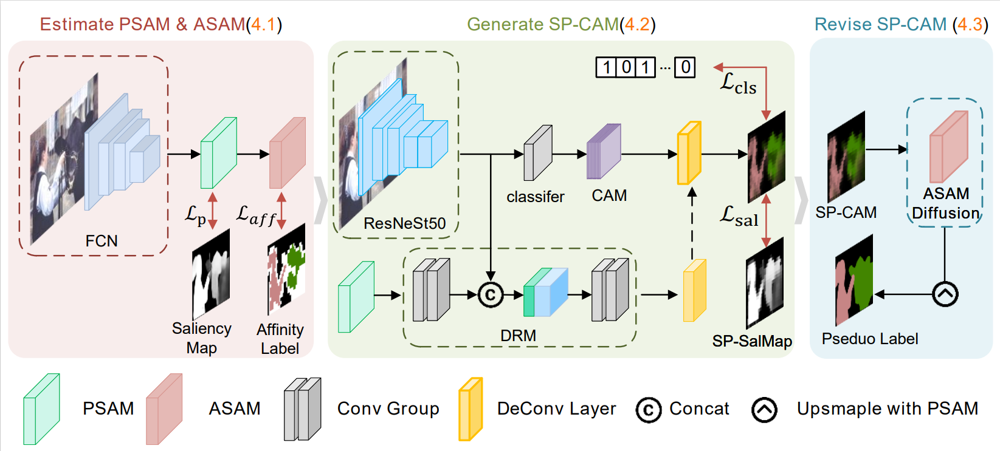

<<<<<<< HEAD


# SP-CAM


## Abstract
Weakly supervised semantic segmentation (WSSS) using
only image-level labels can significantly reduce annotation
costs and attract considerable research attention. Most
advanced WSSS methods exploit the class activation maps
(CAMs) to generate pseudo labels for training the segmentation network. However, the low-resolution CAMs often
lead to low-quality pseudo labels. To overcome this challenge, we propose a novel WSSS framework, in which the
superpixel level class activation map (SP-CAM) is introduced to obtain the explicit pseudo labels. Firstly, the
FCN network with the improved loss is used to generate the
pixel-superpixel association map (PSAM) and the adjacent
superpixel affinity matrix (ASAM). Secondly, a deconvolution reconstruction module (DRM) is devised to approximate SP-CAMs. Finally, SP-CAMs are revised by our postprocessing schemes combining with the ASAM diffusion and
PSAM upsampling, leading to more explicit pseudo labels.
Experimental results on PASCAL VOC 2012 dataset demonstrate the effectiveness of the proposed method, which
yields the new record of the mIoU metric in the weaklysupervised semantic segmentation. 

## Overview


<br>

## Prerequisite
- Python 3.6, PyTorch 1.8.0, and more in requirements.txt
- CUDA 11.1
- 4 x  RTX 3090 GPUs

## Usage

### Install python dependencies
```bash
python3 -m pip install -r requirements.txt
```
### Dataset Download
- PASCAL VOC 2012
    - [Images](http://host.robots.ox.ac.uk/pascal/VOC/voc2012/) 
    - [Saliency maps](https://drive.google.com/file/d/1Za0qNuIwG64-eteuz5SMbWVFL6udsLWd/view?usp=sharing) 
      using [PoolNet]

- MS-COCO 2014
    - [Images](https://cocodataset.org/#home) 
    - [Saliency maps](https://drive.google.com/file/d/1amJWDeLOj567JQMGGsSyqi7-g65dWxr0/view?usp=sharing)  using [PoolNet] 
    - [Segmentation masks](https://drive.google.com/file/d/16wuPinx0rdIP_PO0uYeCn9rfX2-evc-S/view?usp=sharing)


### Classification network  
- Set the dataset root at ```dataset_root.py```.
    ```python
    # \dataset_root.py.
    VOC_ROOT='VOC2012/VOCdevkit/VOC2012/'
    VOC_SAL_ROOT='VOC2012/VOCdevkit/VOC2012/saliency_map/'
    COCO_ROOT='COCO/'
    COCO_SAL_ROOT = 'COCO/saliency_maps_poolnet/'
- Execute the bash file for the three-stage training process.
    ```bash
    # Please see these files for the detail of execution.

    bash scripts/train_all.sh
- Also, the trained FCN model parameters is provided in this repo, you can skip the first two steps and execute the third step directly to generate SP-CAMs.
    ```bash
    # Please see these files for the detail of execution.

    bash script/train_sp_cam.sh

### Segmentation network
- We utilize [DeepLab-V2](https://arxiv.org/abs/1606.00915) 
  for the segmentation network. 
- Please see [deeplab-pytorch](https://github.com/kazuto1011/deeplab-pytorch) for the implementation in PyTorch.
  
## Resluts
### trained SP-CAM mdoel
#### voc
[best model (miou 79.10%)](https://drive.google.com/file/d/1mYTvFK-W7le_5Q-vdeiyyHZMkEYj1Q8H/view?usp=sharing)
#### coco
### segmentation mdoel
=======
# ESC
>>>>>>> SP_CAM/main
